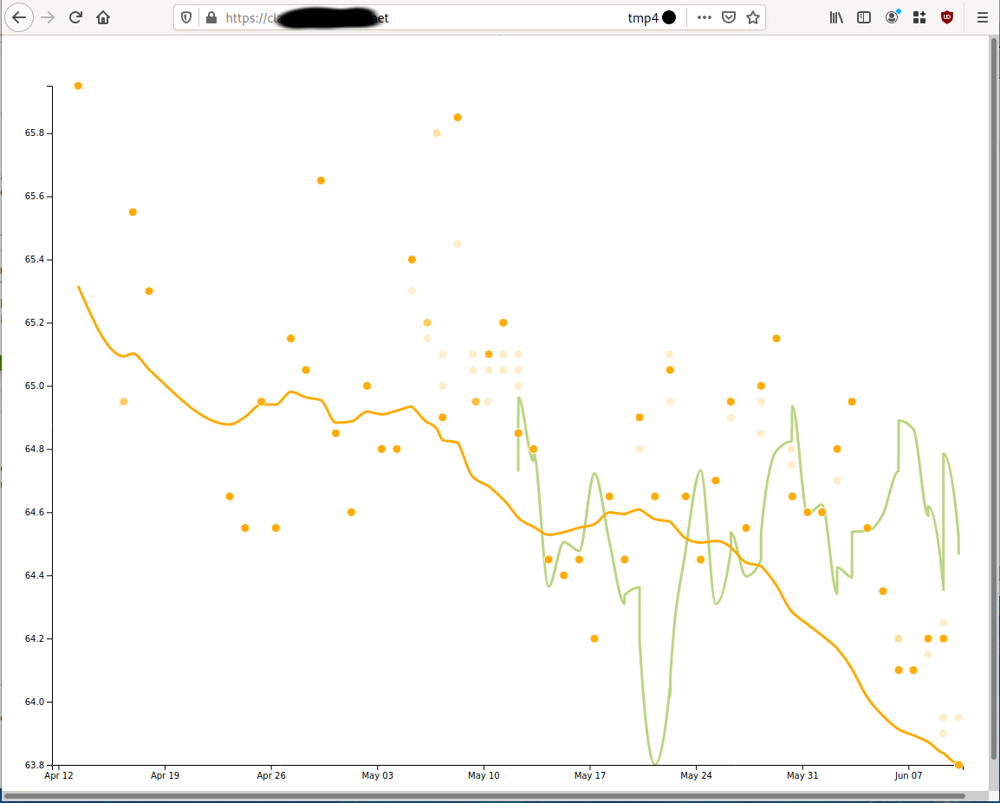

# Clap Hands

> If you're API and you know weight, clap your hands.

If you have a Withings wireless scale and you're not impressed with
the Healthmate web ui, you might find this a bit prettier/more usable.



## Features

* Displays weight measures and trend line based on exponential moving average

* Displays fat percentage

* Zoom and pan using standard gestures (drag, scroll wheel zoom,
  pinch-to-zoom on mobile, etc)

## Installation

It's not in any kind of a "finished" state, but it works well enough
for me to dogfood. Send feedback on these instructions, especially if
you know Python (I don't, much) and they seem unaccountably weird.
Because it's probably not intentional.

Requires Python 3.x where I don't know what x is (3.8 works for me). 

Register a Withings developer application by visiting
https://developer.withings.com/oauth2/#tag/getting-started.  Note down
the Client Id and Consumer Secret they provide you with, and create a
`config.json` file 

```
{
    "WITHINGS_CLIENT_ID": "58cd5442c76439c754e8172e452d184a7c69a2ef2c5d8e71c3db3815f7f4245e",
    "WITHINGS_CONSUMER_SECRET": "ebbe0a47dd30efdb7aa8e6692b65b0610318523a649b8b28465502d8aa5a"
    "WITHINGS_CALLBACK": "https://log-mark-i.example.com/withings/callback",
}
```

### with virtualenv

If you are installing onto a machine (or container) that has other
things on it, you probably want to be using a virtualenv

    git clone https://github.com/telent/log-mark-i.git
    cd log-mark-i
    python -m venv venv
    . venv/bin/activate
    pip install .
    # copy config.json into ./instance
    gunicorn 'logmarki:create_app()'

### system-wide

If you're doing Docker or something, probably you can just do a system
python install

You *should* be able to run

    python -m pip install git+https://github.com/telent/log-mark-i.git
    # copy config.json into /usr/var/logmarki-instance/config.json
    gunicorn 'logmarki:create_app()'

## HTTPS

You will need to create a proxy pointing at it so that you can access
it with HTTPS: I did this with Nginx, but ngrok or something else
would work just as well.  If you don't/won't/can't use HTTPS you need
to edit the call to `response.set_cookie` to remove `secure=True`

## Development

If you're actively hacking on it,

    python -m flask run --host=0.0.0.0 --port=5007

This is my first time writing Python *and* my first time using d3.js,
so the code style may be weird, nonidiomatic, inconsistent, or just
flat-out wrong in places.  Constructive criticism gratefully
received.
